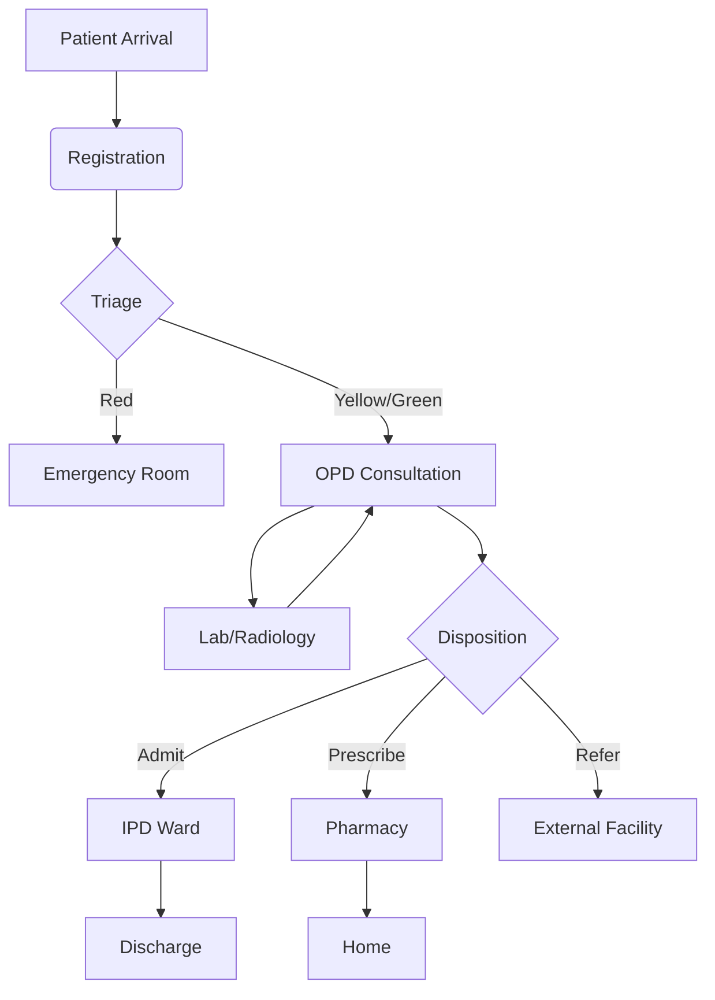

# ZARISH-HIS: CLINICAL SERVICES & PATIENT JOURNEY
**Author:** Mohammad Ariful ISLAM  
**Contact:** zarishsphere@gmail.com  
**Platform:** ZARISH SPHERE  
**Date:** 04 January 2026  
**Time:** 12:00 PM  

---

## 1. PATIENT JOURNEY OVERVIEW

The patient journey in **ZARISH-HIS** is designed to be seamless, capturing data at every touchpoint from registration to discharge or referral.

### 1.1. Step-by-Step Workflow

| Step | Action | Responsible | System Component |
| :--- | :--- | :--- | :--- |
| **1** | **Registration** | Registrar | EMR - Registration Module |
| **2** | **Triage** | Nurse | EMR - Vitals & Triage Form |
| **3** | **Consultation** | Doctor | EMR - Clinical Consultation |
| **4** | **Investigation** | Lab/Radiology | HIS - Associated Services |
| **5** | **Treatment** | Pharmacist | EMR - Pharmacy Module |
| **6** | **Disposition** | Doctor | EMR - Discharge/Referral |

---

## 2. DETAILED SERVICE DEFINITIONS

### 2.1. Outpatient Department (OPD)
The OPD is the primary entry point for most patients.

#### Form: Patient Registration
- **Purpose:** To create a unique digital identity for the patient.
- **Key Fields:**
    - `Full Name`: Text (Mandatory)
    - `Date of Birth`: Date (Mandatory)
    - `Gender`: Dropdown (Male, Female, Other)
    - `Contact Number`: Text (Validation: `+880XXXXXXXXXX`)
    - `Address`: Text (Camp/Block/House)
- **Validation Logic:** System checks for duplicate entries based on Name + DOB + Phone.

#### Form: Triage & Vitals
- **Purpose:** To assess the urgency of care.
- **Key Fields:**
    - `Temperature`: Numeric (°C)
    - `Blood Pressure`: Numeric (Systolic/Diastolic)
    - `Heart Rate`: Numeric (BPM)
    - `Oxygen Saturation`: Numeric (%)
    - `Triage Category`: Dropdown (Red - Emergency, Yellow - Urgent, Green - Routine)

---

### 2.2. Inpatient Department (IPD)
For patients requiring overnight care and monitoring.

#### Form: Admission Record
- **Purpose:** To document the reason for admission and assign a bed.
- **Key Fields:**
    - `Admission Date/Time`: Date/Time (Auto-filled)
    - `Ward/Bed Number`: Dropdown (Linked to Bed Management)
    - `Admitting Diagnosis`: Text (Linked to ICD-11)
    - `Attending Physician`: Dropdown (Staff List)

---

### 2.3. NCD Clinic (Non-Communicable Diseases)
Specialized longitudinal care for chronic conditions.

#### Form: Hypertension Follow-up
- **Purpose:** To monitor blood pressure and medication adherence.
- **Key Fields:**
    - `Current BP`: Numeric
    - `Medication Adherence`: Dropdown (Yes, No, Partial)
    - `Side Effects`: Multi-select (Dizziness, Cough, etc.)
    - `Next Appointment`: Date

---

## 3. DATA VALIDATION STANDARDS

To maintain the "Gold Standard," all forms must adhere to these validation rules:

1. **Numeric Ranges:**
    - Temperature: 34.0 - 42.0 °C
    - Systolic BP: 60 - 250 mmHg
    - SpO2: 50 - 100 %
2. **Mandatory Logic:**
    - Clinical notes cannot be saved without at least one Diagnosis.
    - Prescriptions must include Dosage, Frequency, and Duration.
3. **Date Constraints:**
    - Date of Birth cannot be in the future.
    - Follow-up dates must be after the current date.

---

## 4. VISUAL RELATIONSHIP DIAGRAM (CONCEPTUAL)

---

> "This document ensures that every clinical interaction is recorded with precision, supporting the ZARISH-HIS mission of providing data-driven healthcare excellence."
