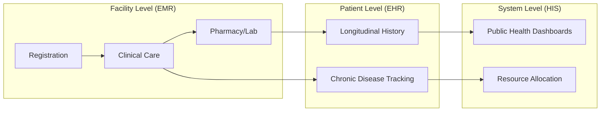

# ZARISH-HIS: COMPLETE EMR, EHR, & HIS SOURCE OF TRUTH
**Author:** Mohammad Ariful ISLAM  
**Contact:** zarishsphere@gmail.com  
**Platform:** ZARISH SPHERE  
**Date:** 04 January 2026  
**Time:** 01:00 PM  

---

## 1. EXECUTIVE SUMMARY

The **ZARISH-HIS** documentation serves as the definitive guide for the development and implementation of a robust, standards-compliant Health Information System. This "Source of Truth" integrates clinical excellence with operational efficiency, tailored for both routine and humanitarian healthcare settings.

### 1.1. Core Documentation Hub
All detailed resources are available in the official repository: [https://github.com/code-and-brain/docs](https://github.com/code-and-brain/docs)

| Document | Purpose | Key Content |
| :--- | :--- | :--- |
| **STANDARDIZATION.md** | Foundation | Categorization, Global Standards, Data Rules. |
| **CLINICAL_SERVICES.md** | Patient Care | Workflows, Clinical Forms, Vitals, Triage. |
| **NON_CLINICAL.md** | Operations | Pharmacy, Lab Admin, Supply Chain, HR. |

---

## 2. INTEGRATED SYSTEM ARCHITECTURE

ZARISH-HIS is built on the principle of **Interconnected Modules**, where data flows seamlessly between different levels of care.

### 2.1. The EMR-EHR-HIS Linkage

> **EMR (Electronic Medical Record):** The digital version of a patient's chart at a single facility.  
> **EHR (Electronic Health Record):** A longitudinal record of patient health information generated by one or more encounters in any care delivery setting.  
> **HIS (Health Information System):** The aggregate system that manages data for health policy, planning, and management.

---

## 3. SERVICE CATEGORY & FORM DIRECTORY

### 01) COMMUNITY HEALTH OUTREACH
- **Form:** Community Screening (NCD/Infectious)
- **Form:** Health Education Session Log

### 02) HEALTH FACILITY (OPD/IPD)
- **Form:** Patient Registration (Identity Creation)
- **Form:** Triage & Vitals (Priority Assessment)
- **Form:** Clinical Consultation (History/Exam/Diagnosis)
- **Form:** Admission/Discharge Record

### 03) SPECIALIZED SERVICES
- **Form:** Surgical Safety Checklist (WHO Standard)
- **Form:** Mental Health Baseline (MHPSS)
- **Form:** NCD Follow-up (Hypertension/Diabetes)
- **Form:** SRH/Maternal Health Record

### 04) ASSOCIATED SERVICES
- **Form:** Lab Order & Result Entry
- **Form:** Radiology Request & Report
- **Form:** Pharmacy Dispensing & Inventory

---

## 4. DATA VALIDATION & LOGIC SUMMARY

| Component | Validation Rule | Format/Range |
| :--- | :--- | :--- |
| **Identity** | Unique Patient ID | `ZSH-YYYY-XXXXX` |
| **Contact** | Phone Number | `+880XXXXXXXXXX` |
| **Clinical** | Temperature | `34.0 - 42.0 °C` |
| **Clinical** | Blood Pressure | `Systolic/Diastolic (mmHg)` |
| **Clinical** | Diagnosis | `ICD-11 Code` |
| **Dates** | Standard Format | `DD MMMM YYYY` |

---

## 5. CONCLUSION

**ZARISH-HIS** is more than a software requirement; it is a commitment to high-quality, data-driven healthcare. By following this "Source of Truth," developers and healthcare providers can ensure that every patient journey is recorded with dignity, accuracy, and clinical excellence.

---

> "Empowering healthcare through standardized data and compassionate technology."
